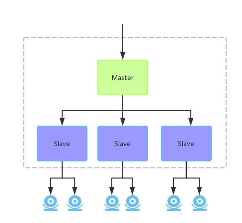
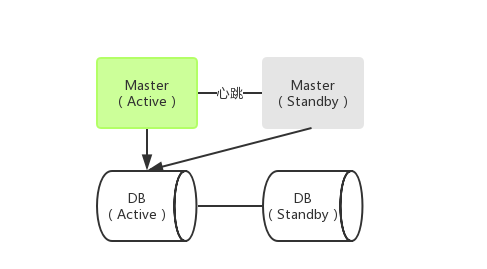

# 视频云技术架构

## 一、分层架构

​	视频云平台管理并控制大量前端摄像头、解码器、传感器等设备，提供统一的视频实时播放、存储、回放、设备控制等服务功能。同时支持视频智能分析，将分析后结构化信息入库。基于视频云平台，可以增量开发各种业务系统，可以根据具体应用场景或者客户需求定制化开发。平台上层业务与底层能力解耦，底层能力支持平滑扩展，且具有高可用性。下图是视频云的基本架构，其中绿色部分是平台的各模块，简单分为PaaS层与SaaS层。

​	由于PaaS的可扩展性与高可用性，数据承载在PaaS层完成。视频云平台可以运行在物理服务器上，也可以运行在Docker容器云上。并且需要云存储支持，公司EFS云存储系统参考CEPH与HDFS实现，针对安防视频应用场景进行一定的定制与优化。

## 二、PaaS服务

​	PaaS服务给上层业务提供视频基础能力，之前称为VAL（Video Ability Layer）视频能力层。PaaS层为一个开放平台，主要提供几种访问方式：

- Restful API：提供对平台功能的操作，例如设备的增删，录像计划设置，设备云台控制等等。

- RTSP/HLS流媒体：提供视频流的获取，例如实时视频流，录像回放流等。

- MQ消息：提供设备状态或报警信息上报。

  目前PaaS服务缺少服务网关，上层需要指定调用某个具体服务，例如设备添加需要调用接入服务接口，获取拉流地址需要调用转发服务接口。

### 1、各服务功能

- 接入服务：接入服务是视频云平台与前端设备的唯一出入口，接入服务负责设备的管理，设备的登录连接，设备控制配置，从设备取流以及接收设备的各种报警数据。支持多种厂家，多种协议，多种类型的设备，统一成一致的接口对外提供服务。
- 转发服务：PaaS由转发服务向上层业务提供媒体数据。支持视频分发，转换等功能。例如将某一路视频，分发给多个客户端。通过级联方式可以不断扩展分发数量。同时转发还支持转换成不同协议格式，例如HLS。
- 存储服务：存储服务负责将设备的视频流存储到云存储中，以及录像查询与回放。可以配置设备的存储计划。
- 智能服务：负责智能分析设备视频流，并将分析得到的结构化数据存储至云数据库或者oracle中，同时通过mq向上层业务发送事件消息。

### 2、服务一般架构

​	视频云PaaS各服务基本架构为Master/Slave模式，Master是服务的入口，对服务的操作首先到达Master节点。Master不做具体业务，它将具体任务下发到某个Slave，由Slave节点执行具体操作。例如下图：

​	比如接入服务，上层业务添加设备至Master节点，然后Master将设备信息下发至Slave节点，再由Slave节点去连接前端设备，以及从前端设备取流。Master可以说是一个负载均衡器，也是一个元数据节点。Master监听Slave的状态，通过动态增删Slave节点，对服务集群进行扩缩容。

​	要保证服务运行，至少需要一个Master和一个Slave。Master/Slave是服务的逻辑架构，实际可以部署在一台物理机上。在实际应用中，有一种小型化机型，一台服务器上面同时部署一个Master和一个Slave，同时还部署多个服务，以及部分SaaS业务。

### 3、服务高可用

​	如上一节所讲，服务架构为Master/Slave，如果Slave节点出现故障，Master会感知并立即将故障节点的任务迁移到其他正常节点。这样迁移，任务会有短暂停止。对于视频流而言，可能会出现一段时间的丢帧或者录像丢失。

​	而针对Master节点故障，服务采用双机热备方案，使用keepalived 或者自研高可用软件，通过VIP漂移来实现主备切换。主备之间通过双网线保持心跳，一条业务线和一条直连心跳线。基本如下图，其中DB也保证高可用：

​	此方案可能出现脑裂问题，但是概率较低，后续可以考虑使用zookeeper来做。如果两个Master节点都故障了，原有在Slave节点上的任务不会受到影响，能够继续执行。只是服务不能接收新的任务请求。

### 4、实时流播放

​	

4、多域

4、多域

